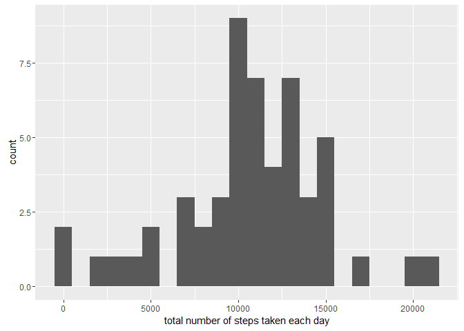
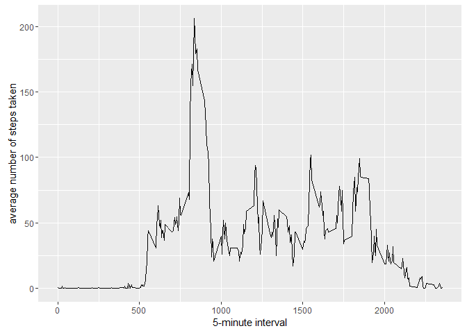

    library(ggplot2)
    library(data.table)
    library(scales)
    library(Hmisc)

    ## Loading required package: lattice

    ## Loading required package: survival

    ## Loading required package: Formula

    ## 
    ## Attaching package: 'Hmisc'

    ## The following objects are masked from 'package:base':
    ## 
    ##     format.pval, round.POSIXt, trunc.POSIXt, units

Set Work Area
-------------

    wd <- file.path ("D:","Users","wbrandl","Coursera","ReproducableResearchCourseProject1")
    setwd (wd)
    if (!file.exists("data")){
      dir.create("data")
    }
    wd <- file.path ("D:","Users","wbrandl","Coursera","ReproducableResearchCourseProject1","data")
    setwd (wd)

Download and Loading and preprocessing the data
-----------------------------------------------

##### 1. Download data file

    download.file("https://d396qusza40orc.cloudfront.net/repdata%2Fdata%2Factivity.zip", "repdataFdataFactivity.zip", method="wininet", quiet = FALSE, mode = "wb",cacheOK = TRUE)

##### 1. Load the data (i.e. read.csv())

    data <- read.csv(unz("repdataFdataFactivity.zip", "activity.csv"), header=T, quote="\"", sep=",")

What is mean total number of steps taken per day?
-------------------------------------------------

    library(data.table)
    datatable <- data.table(data)
    total.steps <- datatable[steps>0,.(stepsperday = sum(steps)),by=.(date)]

##### 1. Make a histogram of the total number of steps taken each day

    qplot(total.steps$stepsperday, binwidth=1000, xlab="total number of steps taken each day")

\#\#\#\#\# 2. Calculate and report the mean and median total number of
steps taken per day

    mean(total.steps$stepsperday, na.rm=TRUE)

    ## [1] 10766.19

    median(total.steps$stepsperday, na.rm=TRUE)

    ## [1] 10765

What is the average daily activity pattern?
-------------------------------------------

    daily.averages <- datatable[!is.na(steps),.(steps=as.integer(mean(steps))),by=.(interval)]

##### 1. Make a time series plot

    ggplot(data=daily.averages, aes(x=interval, y=steps)) +
      geom_line() +
      xlab("5-minute interval") +
      ylab("average number of steps taken")

##### 2. Which 5-minute interval, on average across all the days in the dataset, contains the maximum number of steps?

    daily.averages[which.max(daily.averages$steps),]

    ##    interval steps
    ## 1:      835   206

Imputing missing values
-----------------------

##### 1. Calculate and report the total number of missing values in the dataset

    missing <- is.na(data$steps)
    # How many missing
    table(missing)

    ## missing
    ## FALSE  TRUE 
    ## 15264  2304

##### 2. Devise a strategy for filling in all of the missing values in the dataset.

##### 3. Create a new dataset that is equal to the original dataset but with the missing data filled in.

    activityDataImputed <- data
    activityDataImputed$steps <- activityDataImputed$steps <- impute(data$steps, fun=mean)

##### 4. Make a histogram of the total number of steps taken each day

    stepsByDayImputed <- tapply(activityDataImputed$steps, activityDataImputed$date, sum)
    qplot(stepsByDayImputed, xlab='Total steps per day (Imputed)', ylab='Frequency using binwith 500', binwidth=500)

##### ... and Calculate and report the mean and median total number of steps taken per day.

    stepsByDayMeanImputed <- mean(stepsByDayImputed)
    stepsByDayMedianImputed <- median(stepsByDayImputed)

-   Mean (Imputed): 1.076618910^{4}
-   Median (Imputed): 1.076618910^{4}

------------------------------------------------------------------------

Are there differences in activity patterns between weekdays and weekends?
-------------------------------------------------------------------------

##### 1. Create a new factor variable in the dataset with two levels - "weekday" and "weekend" indicating whether a given date is a weekday or weekend day.

    activityDataImputed$dateType <-  ifelse(as.POSIXlt(activityDataImputed$date)$wday %in% c(0,6), 'weekend', 'weekday')

##### 2. Make a panel plot containing a time series plot

    averagedActivityDataImputed <- aggregate(steps ~ interval + dateType, data=activityDataImputed, mean)
    ggplot(averagedActivityDataImputed, aes(interval, steps)) + 
        geom_line() + 
        facet_grid(dateType ~ .) +
        xlab("5-minute interval") + 
        ylab("avarage number of steps")

